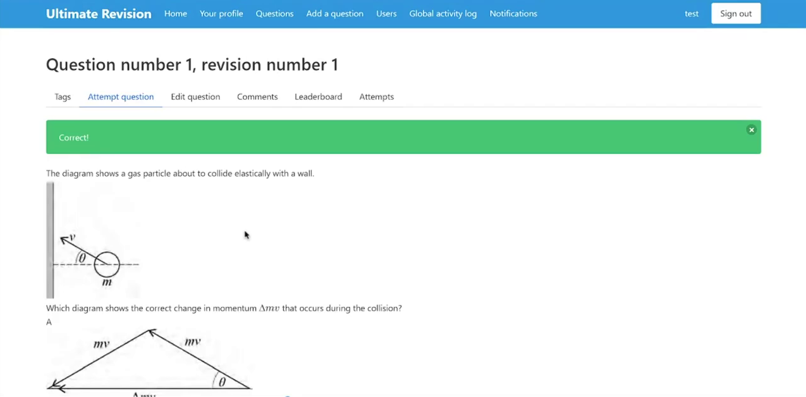

# Ultimate Revision

A revision website I created using Flask and SQLAlchemy.

## Screenshot



## Features

* Sign up/login
* Follow/unfollow users
* Admins (can ban/unban users etc.)
* Add/delete/edit/lock/verify questions (admins can only do the latter two).
* All questions have a revision history, and also support tags for searching.
* Users can attempt multiple-choice or written questions. All attempts are logged.
* Multiple-choice questions are automatically marked, whereas users can mark their own written questions.
* Users gain XP per attempt, which contributes to their level.
* There are global and question-specific leaderboards
* Users can leave comments (which are also nested) on questions, attempts, and profiles
* Users can vote on questions, attempts, and comments
* Users can view their weakest topics
* Notifications inbox when a user logs in, which can be marked read/unread

## License

```
Ultimate Revision - collaborative revision website
Copyright (C) 2020 James Ravindran

This program is free software: you can redistribute it and/or modify it under the terms of the GNU Affero General Public License as published by the Free Software Foundation, either version 3 of the License, or (at your option) any later version.

This program is distributed in the hope that it will be useful, but WITHOUT ANY WARRANTY; without even the implied warranty of MERCHANTABILITY or FITNESS FOR A PARTICULAR PURPOSE.  See the GNU Affero General Public License for more details.

You should have received a copy of the GNU Affero General Public License along with this program.  If not, see <http://www.gnu.org/licenses/>.
```